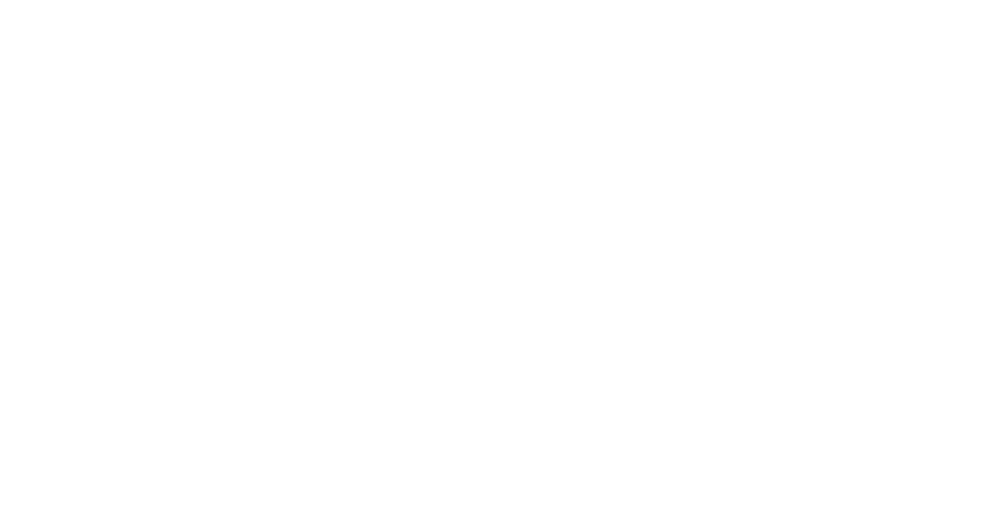

# Bryant Melliza | Software Developer Portfolio



> **Personal portfolio website built with React, Vite, and Tailwind CSS featuring a modern glassmorphism design.**

This project showcases my work as a Full-Stack Developer, including my projects in IoT, Web Development, and Hardware Integration.

## 🚀 Live Demo
[View Live Portfolio](https://portfolio-bry.vercel.app/) *(Replace with your actual Vercel link if different)*

## 🛠️ Tech Stack
- **Framework:** React 19 + Vite
- **Styling:** Tailwind CSS + CSS Modules
- **Animations:** Framer Motion
- **Icons:** Material Symbols & Devicon
- **Deployment:** Vercel

## 💻 Getting Started

Follow these steps to run the project locally on your machine.

### Prerequisites
- Node.js (v18 or higher recommended)
- git

### Installation

1. **Clone the repository**
   ```bash
   git clone https://github.com/brybryson/portfolio.git
   cd portfolio
   ```

2. **Install dependencies**
   ```bash
   npm install
   ```

3. **Start the development server**
   ```bash
   npm run dev
   ```
   Open http://localhost:5173 (or the port shown in your terminal) to view it in the browser.

## 🏗️ Building for Production

To create a production-ready build:

```bash
npm run build
```

The output will be in the `dist` folder, ready for deployment.

## 📄 License
© 2026 Bryant Melliza. All Rights Reserved.
